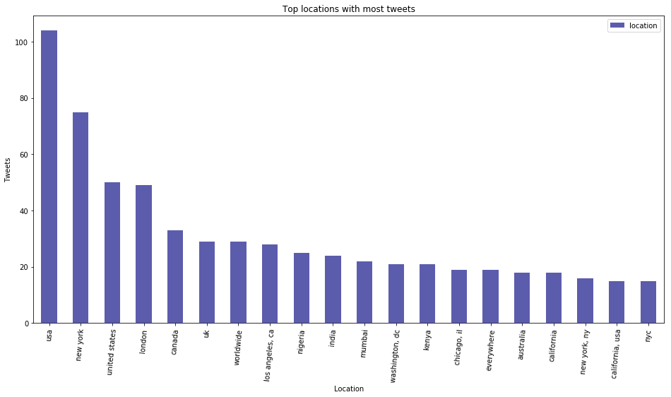
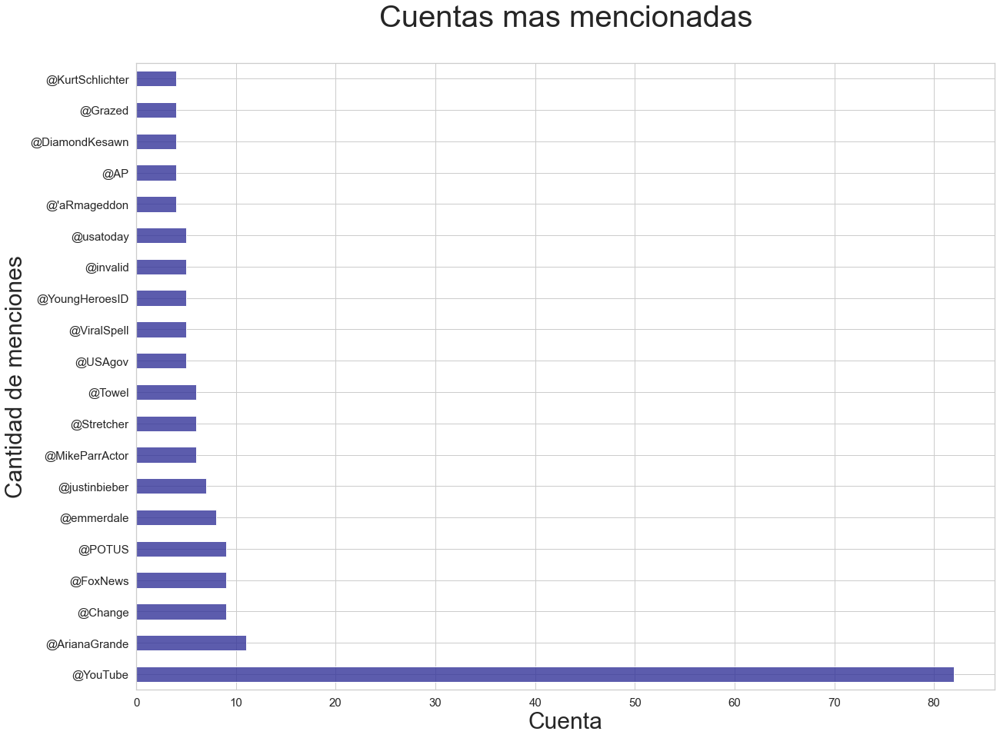
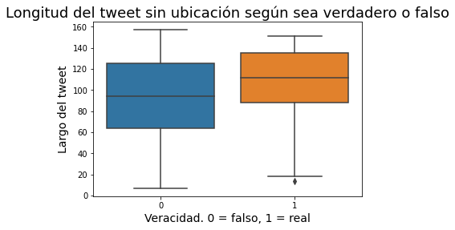

### 75.06/95.58 Organización de Datos: Trabajo Práctico 1 
### Análisis Exploratorio
------

### Introducción: El dataset

El dataset está compuesto por 7613 filas, contiene 5 columnas:
* id
* keyword
* location
* text : Contenido de un tweet sobre un desastre.
* target: Veracidad del tweet, 1 = real, 0 = falso.

No todos los tweets tienen asociado una locación o palabra clave. Respecto a la columna de texto se detecta que hay tweets repetidos con distintos grados de verdad, es decir, el mismo texto es calificado como real y falso. Se decidió eliminar la totalidad de los duplicados ya que no representan una muestra significativa y no hay otro criterio más que el aleatorio para conservar uno de cada grupo de repetidos.

### Cantidad de tweets reales vs. falsos

La distribución reales contra falsos es de un 58% de falsos contra un 42% de reales. 

### Top ciudades con mayor cantidad de tweets reales/falsos

Una vez que se descartaron las locaciones nulas, como primera observación se ve que hay muchas locaciones incoherentes o falsas. Para descartar la mayor cantidad de datos falsos se filtró de la siguiente forma:

1. Se ejecuta una regex que captura solamente aquellas que tienen los caracteres de la 'a' a la 'z', comas y espacios. Se decide ignorar locaciones que no existen compuestas por símbolos, por ejemplo, 'Instagram: trillrebel_'.

2. Todo el texto a lower case, una vez que todo está en minúscula desaparece la diferencia entre, por ejemplo, 'USA' y 'usa'.

3. Una vez agrupado por 'location' se puede ver que no se eliminó por completo el problema de lugares redundantes, en el gráfico vemos que está: 'new york', 'nyc' y 'new york, ny'. 

4. Utilización de la librería [GeoPy]: Esta librería recibe la columna 'location' del dataframe y el resultado se almacena en la columna 'geodata'. Geopy dada la locación devuelve (principalmete) address y point. Adress es la dirección completa del lugar, por ejemplo, 'City of Melbourne, Victoria, Australia', y point contiene las coordenadas. GeoPy da la opción de utilizar cualquier servicio de geocoding, en este caso se utilizó [Nominatim]. Nominatim es un servicio gratuito y open-source, permite un máximo de un request por segundo y eso hace que sea poco performante en tiempo. Es por eso que se persiste el archivo locations.csv, y solo es necesario correr GeoPy si no se encuentra el csv.
Una vez finalizado el filtrado con GeoPy se observa que no se encontraron 374 locaciones, el 94% de ellas con una sola aparición. Podría volver a pasarse el servicio de geocoding pero se decidió descartarlas.

[GeoPy]: https://geopy.readthedocs.io/en/stable/
[Nominatim]: https://nominatim.org/

Una vez filtrado el dataset obtenemos:

Los 10 lugares con mayor cantidad de tweets sobre desastres reales:

Los 10 lugares con mayor cantidad de tweets sobre desastres falsos:

__Conclusiones:__ A priori los resultados son pequeños en proporción al tamaño del set. No podemos asegurar que haya una relación entre ubicación del tweet y nivel de veracidad. Se puede observar una tendencia a que ciudades de Estados Unidos compongan los dos top 10 pero esto puede ser explicado por las [estadísticas] de la red social Twitter que muestran que Estados Unidos compone el 64.2% de los usuarios, y así también la ciudad de Nueva York, que se encuentra en ambos top 10, es la ciudad más poblada de Estados Unidos. 

[estadísticas] = https://www.statista.com/statistics/242606/number-of-active-twitter-users-in-selected-countries/

### Locaciones no encontradas

__Hipótesis:__ Si bien el sistema de geocoding funcionó exitosamente en una gran parte del set habrá ubicaciones reales que no se encontraron.

Las siguientes son las ubicaciones no encontradas por GeoPy mas frecuentes:

* road to the billionaires club
* edinburgh
* america of founding fathers
* bangalore, india
* buy give me my money
* financial news and views
* five down from the coffeeshop
* washington dc
* eastcarolina
* eic
* el dorado, arkansas
* england, united kingdom
* in the potters hands
* mad as hell
* reddit

### Top paises participantes:

__Hipótesis:__ Por lo antes mencionado Estados Unidos es el país que mas cantidad de tweets tienen en su ubicación.

Con el dataset obtenido en el filtrado de locaciones se genera la columna 'country'. En la primera iteración se encuentra que hay paises redundantes, por ejemplo, 'United States' Y 'United States of America', por otro lado es necesario eliminar los espacios que también generan redundancias, como 'Nigeria' y 'Nigeria '. 
* Primera iteración:

| country					| total	| real | fake |
| ------------------------- |:-----:| ----:|-----:|
| United States of America 	| 1705	| 700  | 1005 |
| United Kingdom			| 384	| 143  | 241  |
| Canada	   				| 239	| 114  | 125  |
| United States				| 168	| 103  | 65   |     
| Australia					| 106	| 57   | 49   |
| India						| 84	| 54   | 30   |
| Nigeria					| 61	| 43   | 18   |
| Kenya						| 39	| 15   | 24   |
| Philippines				| 39	| 15   | 24   |
| Italia					| 34	| 10   | 24   |
| República Dominicana		| 32	| 21   | 11   |
| South Africa				| 31	| 10   | 21   |
| Indonesia					| 29	| 16   | 13   |
| France					| 25	| 12   | 13   |
| Ireland					| 25    | 9	   | 16   |

* Segunda iteración:

Para esta parte del análisis se optó geopandas para mostrar los paises del dataset en el mapa. El dataframe que provee geopandas está en inglés y algunos de los paises en 'country' están en español, por ejemplo, 'Italia'. Con la API de google translator se tradujeron todas las ubicaciones a inglés. Finalmente:

Según cantidad de tweets:

Según grado de veracidad del tweet:

__Conclusión:__ La hipótesis fue confirmada, Estados Unidos es el país con mayor cantidad de tweets del set.

### Personas más mencionadas

Se busca encontrar las cuentas de twitter más mencionadas y su relación entre tweets sobre desastres reales y falsos. Se ejecuta una regex sobre los tweets que contienen el caracter '@', esta se encarga de filtrar todas las cuentas mencionadas ignorando espacios ya que el arroba también se utiliza como una abreviación de 'at' en inglés. 

Personas mencionadas en tweets que solo tienen calificación falsa:

__Conclusiones:__ Si bien no hay una cantidad de menciones suficientes para sacar una conclusión que muestre correlación entre menciones y veracidad del tweet se puede observar una tendencia de tweets con calificación falsa dirigidos a personas relacionadas con el mundo del espectáculo, en este caso Ariana Grande y Justin Bieber son artistas pop juveniles y Michael Parr es un actor. p

### Relación real-fake si location y/o keyword es nulo

* Los tweets con keyword nula, son solo 56 de un set de mas de 7600. No representa una muestra significativa para sacar una conclusión.

* Respecto a los tweets de ubicación nula los reales y los falsos continuan manteniendo la proporción de 58%-42%. Se decide aplicar un filtro más agrupándolos por largo del tweet.

__Conclusión:__ Como se observa en el gráfico no se encuentra una relación entre grado de veracidad y si el tweet tiene una ubicación. 

