### 75.06/95.58 Organización de Datos: Trabajo Práctico 1 
### Análisis Exploratorio
------

## Introducción

### El dataset

Se obtuvo el dataset de: https://www.kaggle.com/c/nlp-getting-started y es el archivo `train.csv`.

Está compuesto por 7613 filas, contiene 5 columnas:

* id: Identificador único del tweet.
* keyword: Palabra clave sobre el texto del tweet. Puede tener o no.
* location: Ubicación de donde el tweet fue mandado. Puede tener o no.
* text : Contenido de un tweet sobre un desastre.
* target: Veracidad del tweet, 1 = real, 0 = falso.

### Primer acercamiento

Respecto a la columna de texto se detecta que hay tweets repetidos con distintos grados de verdad, es decir, el mismo texto es calificado como real y falso. Se decidió eliminar la totalidad de los duplicados ya que no representan una muestra significativa y no hay otro criterio más que el aleatorio para conservar al menos uno de cada grupo de repetidos.

### Cantidad de tweets reales vs. falsos

La distribución reales contra falsos es de un 58% de falsos contra un 42% de reales. 

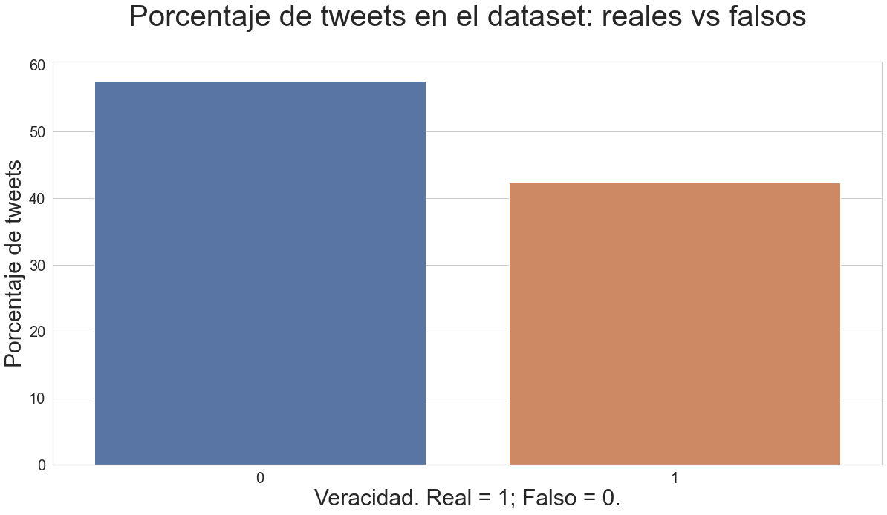

## Desastres

## Texto

### Palabras más usadas en los tweets
Para este análisis se decidió separar a los verdaderos y los falsos, y analizar si existia alguna diferencia entre las palabras que más aparecen.

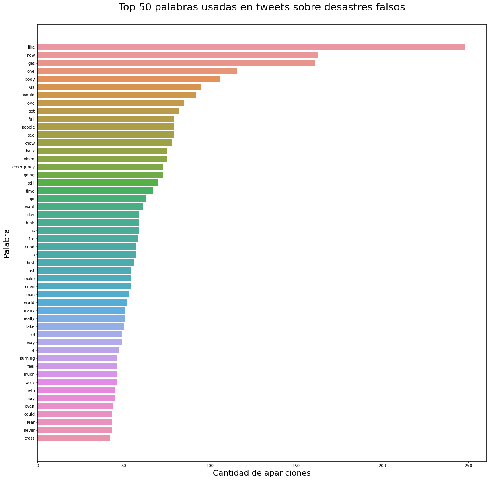

__Conclusión:__ Podemos ver que las palabras más usadas en falsos tienen una mayor diferencia en la cantidad con respecto a las verdaderas, puesto que el descenso en la cantidad de repeticiones en los falsos es mucho más rapido que en el de su contraparte, esto se puede deber a que en los tweets falsos se suelen utilizar muchas más palabras,evitando asi concentraciones de unas pocas; mientras que en los reales existe un conjunto de palabras similares que suele repetirse (por ejemplo: "people/kill/police/disaster" / "gente,asesinar,policia,desastre" ).

### Metaanálisis - Métricas de longitud del tweet y derivados.

Para el inicio del análisis del texto de los tweets en relación a su longitud se comenzó por tomar un subset del dataframe original y se le agregó una columna de longitud en caracteres para cada tweet individual.
En base a esto se realizaron análisis básicos sobre la **longitud del tweet**.

Según lo observado se puede apreciar que los tweets falsos se distribuyen más equitativamente en casi todas sus longitudes (en caracteres) mientras que los reales se agrupan mayoritariamente en longitudes mayores y ambos tienen una cantidad mucho mayor en el rango de 120 a 140 caracteres que es el más comun entre ambos.

Por otro lado, se analizó por separado el largo de cada tweet en promedio en relación al si eran reales o no y se dio el siguiente resultado.

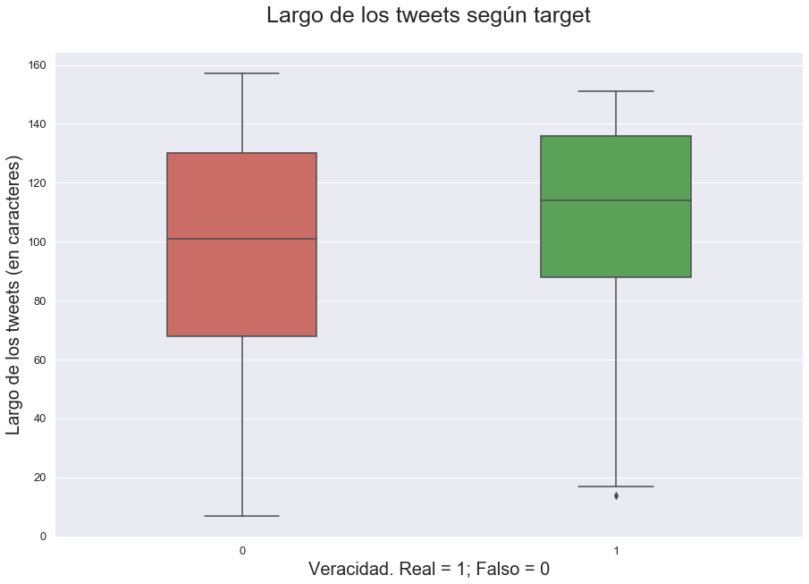

**Conclusión**: Como se puede observar, es notable que los tweets que aportan información sobre desastres frecuentan ser más largos que los que no brindan dicha información ya que se los observa más comprimidos en una longitud mayor que los que no son reales.

Esto se puede deber a que los tweets que brindan información sobre desastres suelen tener más contenido ya que dan detalles sobre lo ocurrido.
En base a esto se puede afirmar que los tweets de longitud mayor tienden a ser más veraces que los que no, aunque no es una tendencia excesivamente marcada.

A continuación se analizó el largo promedio de cada palabra individual utilizada en los tweets.

**Hipótesis**: Se espera que el resultado de este análisis individual arroje como resultado que al informar sobre desastres se utilice un vocabulario más amplio que permita expresar los detalles del suceso con exactitud y detalle, con lo cual se espera que el largo promedio de las palabras utilizadas sea mayor en tweets reales que en falsos.

**Conclusión**: Como fue previsto, el largo promedio dio como resultado un número mayor en tweets reales, sin mostrar una tendencia demásiado marcada. Con lo cual podemos afirmar que el rango de lenguaje utilizado en tweets reales es más amplio y que los tweets falsos suelen utilizar mayor cantidad de contracciones.

Subsiguientemente se añadieron más columnas útiles para el análisis entre las cuales se analizan a continuación la longitud en palabras del tweet.

**Conclusión**: Como se puede observar, y en coincidencia con el primer gráfico de este tópico de análisis, los tweets falsos muestran una tendencia más marcada a tener longitudes tanto cortas como largas, mientras que los tweets reales se agrupan mayormente en el rango de 10 a 20 palabras, pero suelen tener más palabras que los falsos, lo cual se corresponde con la intención de informar detalladamente sobre desastres que ocurrieron en ese momento.

Además, se analizó la longitud en palabras únicas del tweet, es decir, sin repetir.

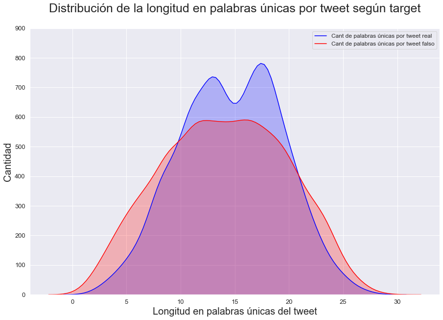

Se observa entonces un comportamiento muy similar y acorde al anterior con ciertos cambios en la cantidad más frecuente de tweets reales que no aporta resultados significativos al análisis.

Luego, se añadieron más columnas útiles para el análisis tales como: _está por arriba del largo promedio; largo promedio de las palabras del tweet; contiene link._

Una vez hecho esto se realizó un mapa de calor (_heatmap_) que muestra la correlación entre cada columna a través del método de [Pearson], que devuelve un valor entre -1 y +1, donde 1 es correlación total positiva, 0 no hay correlación y -1 es correlación total negativa.

[Pearson]: https://en.wikipedia.org/wiki/Pearson_correlation_coefficient

**Conclusiones del heatmap pendientes**

### Sentimiento del tweet.

Para realizar el siguiente análisis, se utilizó una de las bibliotecas ofrecidas por
[NLKT], la cual brinda información acerca de qué porcentaje de sentimiento neutro, sentimiento positivo, sentimiento negativo y su respectivo compuesto de los tipos transmite el texto estudiado.

**Hipótesis inicial**: En el contexto de informar sobre desastres se espera que además de usuarios individuales, agencias de noticias sean las comunicadoras de estos sucesos, con lo cual la redacción del contenido del tweet debe apuntar a que sea objetivo y lo más neutro posible.

**Hipótesis refinada**: Considerando que se utiliza una herramienta que procesa y asigna valores a palabras y frases de manera aislada, se espera que dado que la temática de los tweets es sobre desastres, el análisis debería arrojar resultados neutros tendiendo a negativos. Esto es porque el uso de ciertas palabras específicas relacionadas a desastres no implican sentimiento positivo. Además, al informar sobre desastres las palabras que describen este tipo de sucesos apuntan en general a cosas más negativas.

Para éste análisis se separó en tweets reales y falsos sobre los cuales se calculó el sentimiento para cada tweet individual de manera que se obtuvieron los siguientes resultados.

**Conclusión**: Como se previó en las hipótesis, el sentimiento de un tweet falso está distribuído más equitativamente del lado negativo y positivo, mientras que el sentimiento de un tweet real se inclina más sobre el lado negativo que el positivo. Además, ambos presentan una gran cantidad de tweets con sentimiento neutro (igual a 0).
Esto confirma la hipótesis de que los tweets reales tienen una connotación negativa mayor dado que se estima que se nombres desastres y eventos que impactan negativamente en la sociedad.

Como complemento al análisis gráfico se calcularon los valores medios de los tweets reales y falsos para dar una idea más analítica del análisis.

* Media del sentimiento en tweets reales: -0.26414053968253864.
* Media del sentimiento en tweets falsos: -0.0601307656395891.
* Media del sentimiento en tweets en general: -0.14657558514931382.

Adicionalmente, se realizó una visualización sobre los valores individuales de los sentimientos que brindó NLKT, de los cuales se obtuvo lo siguiente.

Esta última visualización permite observar de manera más analítica que los tweets reales tienen mucho menor contenido positivo que los falsos que se distribuyen de manera más equitativa.

[NLKT]: https://www.nltk.org/api/nltk.sentiment.html

### Cantidad de stopwords según target

Basándose en el concepto de stopword, definido como palabra vacía (tales como las preposiciones, articulos, pronombres, entre otros), derivado del procesamiento de datos en lenguaje natural (NLP) se procedió a encontrar una relación directa entre la cantidad de stopwords por tweet y su correlacion con el target, partiendo de la hipótesis que a mayor cantidad de stopwords más probabilidad de que el tweet sea falso.
Para la implementación del análisis se utilizó la libreria [gensim] que cuenta con una lista de stopwords y se contaron sus apariciones en los diferentes tweets, para luego hacer un recuento total según target, arrojando los datos presentados en el siguiente gráfico.

[gensim]:  https://radimrehurek.com/gensim/parsing-preprocessing.html

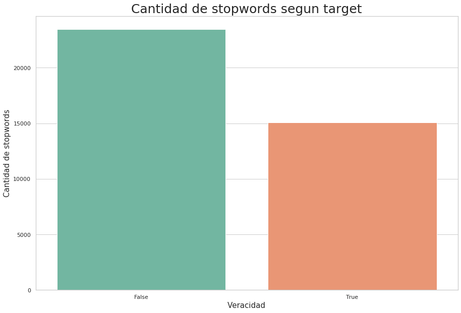

__Conclusión:__ Podemos observar claramente en el gráfico una tendencia a que los tweets verdaderos contienen menos cantidad de las denominadas stopwords (aproximadamente un 30% menos que los falsos ), confirmando la primera aproximación informada.

### Uso de puntuación

Para el siguiente análisis se utilizaron los contenidos de puntuación provistos por la librería [string] tales como punto, coma, signo de admiración, etc., con el objetivo de analizar el uso de puntuación en el contenido de los tweets.

**Hipótesis**: El contenido de un tweet que desea transmitir una noticia sobre algún desastre debería estar bien redactado, esto implica que se utilizan oportunamente caracteres de puntuación para expresar con claridad la noticia. En base a esto, se puede inferir que un tweet puede contener una cantidad más alta de puntuaciones si se trata de un caso real, que de un caso falso, ya que éste último no tiene dicha intención y tiene más libertad de redactar el contenido sin seguir ciertas normás como lo hacen los tweets de cadenas de noticias o que aportan información precisa.

Inicialmente se quiso realizar un análisis sobre la relación entre si el tweet contenía algún caracter de puntuación y su target, pero los resultados analíticos preliminares mostraron que no ameritaba un análisis significativo ya que casi todos los tweets poseían algún tipo de puntuación. Esto es:
* Falsos: 93,66% contiene puntuación;
* Reales: 98% contiene puntuación.

Si, en cambio, ameritaba realizar un análisis sobre la _cantidad_ de puntuación utilizada según target.

Previo a realizar la visualización se realizó una exploración de los datos y se filtraron 4 casos de tweets que, por la cantidad, no aportaban valores significativos al análisis ya que poseían una cantidad de puntuaciones mayor a 50 (particularmente 50, 50, 52 y 61), y generaban una visualización que perdía el foco en el objetivo del análisis.

Luego de esto se procedió a realizar la siguiente visualización.

**Conclusión**: Aquí entonces se puede observar que la hipótesis se cumple ya que hay una mayor cantidad de tweets falsos con poca cantidad de caracteres de puntuación y que va decreciendo sostenidamente. Por otro lado, hay una cantidad considerablemente menor de tweets reales que poseen poca puntuación y hay una mayor cantidad de tweets con más puntuación (que promedia entre 5 y 10 caracteres), lo que confirma la hipótesis que al transmitir noticias sobre desastres se formulan con un uso más adecuado del lenguaje.

Adicionalmente se calcularon analíticamente los promedios para complementar estos resultados:
* Promedio de caracteres de puntuación en tweets reales: 7.567937
* Promedio de caracteres de puntuación en tweets falsos: 6.263785

Esto reafirma lo dicho arriba ya que se ve que el uso de puntuación es un poco mayor en tweets reales.

[string]: https://docs.python.org/2/library/string.html

### Similitudes entre tweets
Se buscó analizar el parecido entre los propios tweets (verdaderos y falsos separados) para ver si existía alguna relación. Para ello utilizamos [LHS] y fuimos variando que porcentaje de similitud mínimo tenian que tener para ser considerados parecidos. Para obtener una mayor cantidad de valores decidimos variar esta similitud desde 1% hasta 99% escalando de a 1%, y en cada paso calcular el promedio general de cuantos parecidos tienen los tweets.

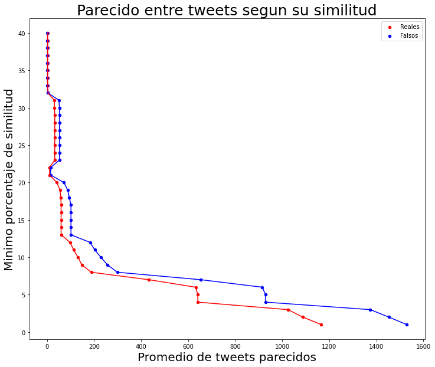

__Conclusión:__ Se aprecia que cuando el porcentaje de similitud esta por debajo del 10% se obtienen muchos tweets similares, con la particularidad de que en los verdaderos el parecido se da mucha menos veces que en los falsos. Vemos que sin embargo, este parecido entre tweets no dura mucho, pues cuando el minimo de similitud ronda el 20% decae abruptamente la cantidad de parecidos; sin embargo la cantidad de parecidos de los falsos supera la cantidad de los verdaderos para igual umbral minimo de similitud.

[LHS]: https://en.wikipedia.org/wiki/Locality-sensitive_hashing

## Texto: Links

En esta sección del análisis se pretendió ver la relación entre la utilización de links en tweets y la veracidad de ellos.
Para lograr esto se añadió una columna que especifica si el tweet posee un link, de manera que se pueda analizar la cantidad de tweets que poseen links y ver qué tipo de relación conlleva con la veracidad.

**Hipótesis**: Se espera que si un tweet posee un link, éste lleve al usuario a una página relacionada al desastre sobre el que el tweet habla, particularmente para los reales. En cuanto a los falsos la utilización de un link puede ser para diversos propósitos pero en general las agencias de noticias hacen uso de links con mucha mayor frecuencia. Es por esto que se espera que la cantidad de tweets que posean link sea mayor si son reales, y por el contrario, si son falsos la cantidad sea menor.

**Conclusión**: Por lo visto en el gráfico, la hipótesis es confirmada y queda muy claro que los tweets falsos tienen una mayor cantidad de tweets que no poseen links. Mientras que los reales con links superan ampliamente a los reales sin ellos, aunque haya una menor cantidad de tweets reales sobre los que analizar. En particular, la cantidad de tweets falsos es de 4284 y la cantidad de tweets reales es 3150.

Adicionalmente, se quiso explorar particularmente los tweets que poseían links. Para lo cual se exploró una métrica más básica: la longitud del tweet.

**Hipótesis**: Según lo visto arriba, se asume que los tweets que no poseen links deberían ser más cortos en general, dado que por más que los links estén con _url shorteners_, inevitablemente se añaden caracteres al tweet.

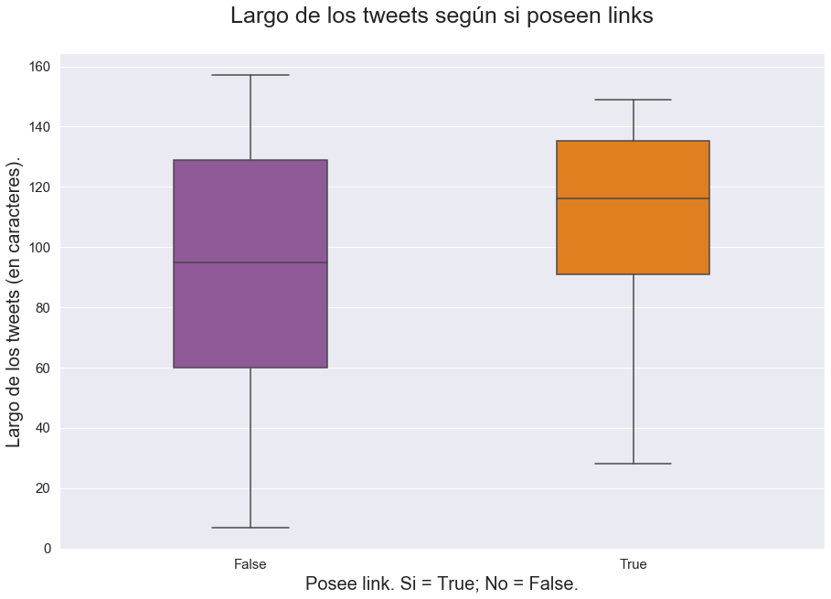

**Conclusión**: Por lo visto en el gráfico la hipótesis es correcta y efectivamente los tweets que no poseen link son considerablemente más cortos que los que si. Además, los tweets que poseen link se los ve mucho más comprimidos en una longitud mayor, lo cual puede relacionarse con que se quiera comunicar un desastre real, proveyendo detalles sobre el suceso e incluyendo un link a la noticia.

Finalmente, en cuanto a links se quiso explorar el comportamiento de tweets con links más seguros y menos seguros. Esto es, links que utilizan [http] (menos seguro) o [https] (más seguro). 

El _link wrapping_ provisto por twitter (dominio t.co) asocia links más seguros a https, y menos seguros a http. Según el sitio [twitter developer]:
_When a HTTPS-based URL is passed while link wrapping is enabled, a HTTPS-based t.co link will be produced. HTTPS-based t.co links are one character longer than standard t.co links to account for the protocol change._
Esto es por el protocolo más seguro HTTPS.

Para esto, se filtraron los tweets que contenían links y se los dividió según protocolo.
Es importante notar que la cantidad de tweets con [https] es mucho menor a la cantidad de tweets con [http]. Esto puede deberse a la fecha de generación de estos tweets (desconocida) o a pura coincidencia del dataset.

* Cantidad de tweets con link más seguro: 403
* Cantidad de tweets con link menos seguro: 3556

**Hipótesis**: Se espera que la utilización de links **seguros** sea más frecuente en tweets reales ya que las agencias de noticias suelen manejarse con tecnologías más actualizadas en cuanto a seguridad. Sin embargo, hay muy pocos tweets con links más seguros en el dataset, lo cual puede que impida ver una tendencia marcada. Por otro lado, se espera que la utilización de links **no seguros** sea más frecuente en tweets falsos ya que pueden ser provistos por páginas sin verificar y no aportan información veraz sobre desastres. En este caso, hay muchos tweets con links menos seguros en el dataset.

**Conclusión**: Por lo visto en el gráfico, nada de los predicho fue cumplido ya que hay una _menor_ cantidad de tweets con links más seguros reales que falsos, mientras que los tweets con links menos seguros son más frecuentes en los tweets reales. Sin embargo, esto último se correlaciona con lo visto previamente, que existe una mayor cantidad de tweets reales con links. La utilización de links menos seguros puede darse por, nuevamente, la fecha de generación de estos tweets (desconocida) o ser pura coincidencia del dataset.

[http]: https://en.wikipedia.org/wiki/Hypertext_Transfer_Protocol
[https]: https://en.wikipedia.org/wiki/HTTPS
[twitter developer]: https://developer.twitter.com/en/docs/basics/tco

## Texto: Menciones

### Personas más mencionadas

Se busca encontrar las cuentas de twitter más mencionadas y su relación entre tweets sobre desastres reales y falsos. Se ejecuta una regex sobre los tweets que contienen el caracter "@", esta se encarga de filtrar todas las cuentas mencionadas ignorando espacios ya que el arroba también se utiliza como una abreviación de "at" en inglés. 

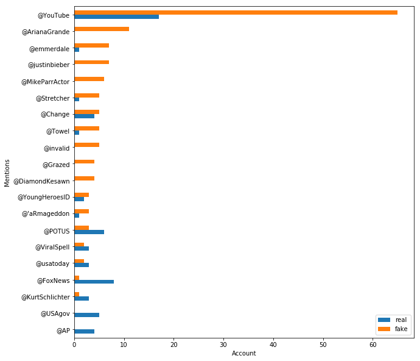

Personas mencionadas en tweets que solo tienen calificación falsa:

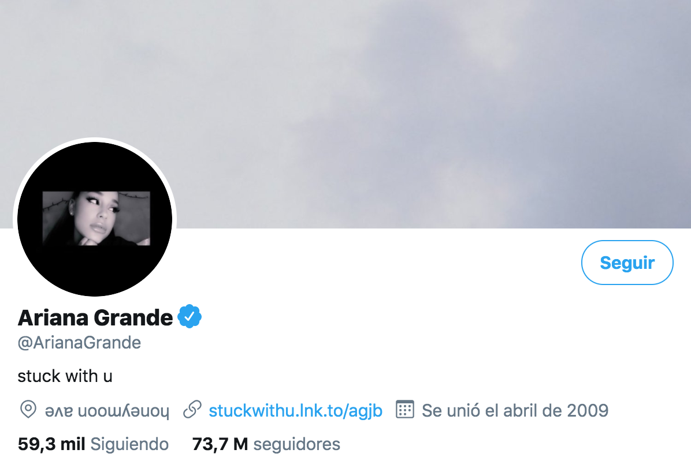

__Conclusiones:__ Si bien no hay una cantidad de menciones suficientes para sacar una conclusión que muestre correlación entre menciones y veracidad del tweet se puede observar una tendencia de tweets con calificación falsa dirigidos a personas relacionadas con el mundo del espectáculo, en este caso Ariana Grande y Justin Bieber son artistas pop juveniles y Michael Parr es un actor. 

## Texto: Hashtags

### Hashtags más usados en los tweets
Con lo calculado previamente en trending topics por ubicacion, se decidio tambien analizar cuales eran los más utilizados sin importar la ubicacion.

__Conclusión:__ Podemos observar que, por lejos, "#news" es el más utilizado, sin embargo no sabemos con certeza si es por los tweets reales o falsos, para eso podemos realizar un segundo análisis en donde los separamos y analizamos lo mismo.

__Conclusión:__ Ahora que obtuvimos los datos separados, podemos concluir que "#news" viene de ambas partes, sin embargo la mayor cantidad, casi 2/3, se encuentran en los reales; mientras que del segundo más usado al cuarto, la cantidad de veces usado en falsos  es casi identica a la cantidad de veces usado en los verdaderos.
Para una mayor distincion, se grafican, separados por veracidad, los hashtags más usados por cada uno.

Para estos ultimos graficos se utilizó la herramienta [wordcloud] e [imageio].

[wordcloud]: https://pypi.org/project/wordcloud/
[imageio]: https://pypi.org/project/imageio/

### Trending topics en las ubicaciones más recurrentes

Para el siguiente análisis se filtró y aisló, del texto de los tweets, los hashtags allí contenidos. Finalmente agrupando por la máxima ocurrencia de tanto los hashtags como las ubicaciones allí twitteadas.

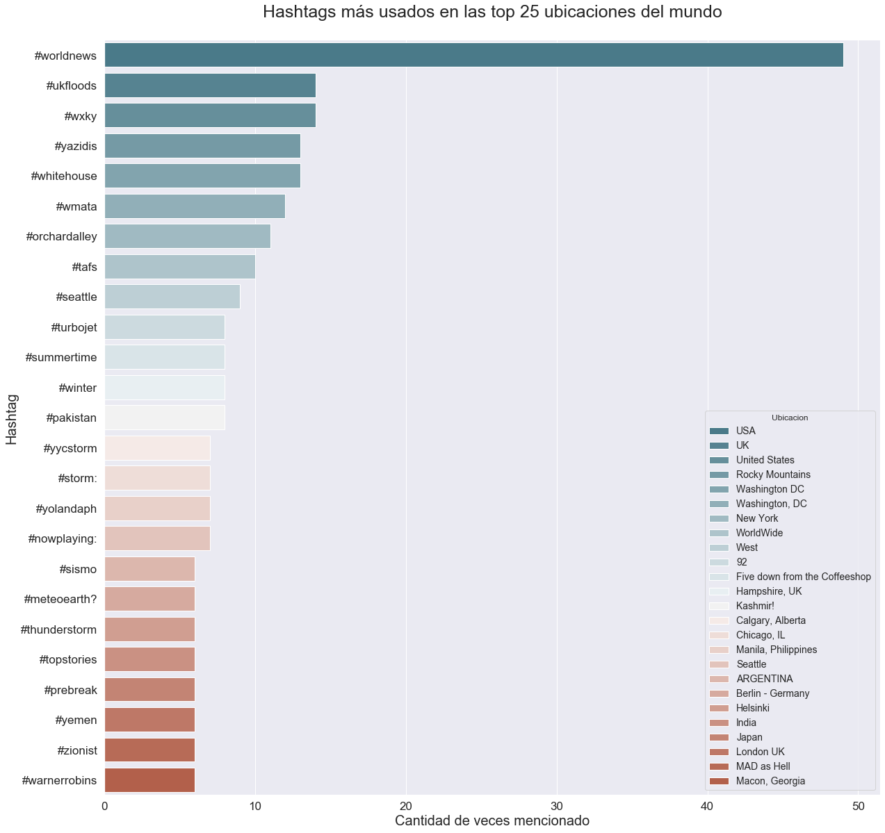

Haciendo una observación al gráfico y  una busqueda paralela de datos se encontró una clara relación entre los hashtags más utilizados y el lugar de donde provienen. 
Es el caso de ukfloods, tendencia en el Reino Unido, haciendo referencia a [inundaciones] producidas en noviembre de 2019 que causaron daños de al menos 150 millones de libras.
El hashtag yazidis, trending topic en Rocky Mountains, hace pensar que la ubicación fue mal interpretada, ya que puede tratarse de un exilio másivo sufrida por esa comunidad en el año 2014, a partir de una [ataque militar estadounidense], hacia una zona montañosa en Iraq.
WXKY, radio localizada en el estado de Kentucky.
La presencia de whitehouse como tendencia en Washington DC nos lleva a concluir que los hashtags que más apariciones presentan tienen una relación directa con su ubicación.

[ataque militar estadounidense]:https://www.washingtonpost.com/world/exodus-from-the-mountain-yazidis-flood-into-iraq-following-us-airstrikes/2014/08/10/f8349f2a-04da-4d60-98ef-85fe66c82002_story.html
[inundaciones]:https://en.wikipedia.org/wiki/2019%E2%80%9320_United_Kingdom_floods

## Ubicaciones

### Top ciudades con mayor cantidad de tweets reales y falsos

Una vez que se descartaron las ubicaciones nulas, como primera observación se ve que hay muchas incoherentes o falsas. Para descartar la mayor cantidad de datos falsos se filtró de la siguiente forma:

1. Se ejecuta una regex que captura solamente aquellas ubicaciones que tienen los caracteres de la 'a' a la 'z', comás y espacios. Se decide ignorar ubicaciones que no existen compuestas por símbolos, por ejemplo, "Instagram: trillrebel_".

2. Todo el texto a lower case, una vez que todo está en minúscula desaparece la diferencia entre, por ejemplo, "USA" y "usa".

3. Una vez agrupado por 'location' se puede ver que no se eliminó por completo el problema de lugares redundantes, en el gráfico vemos que está: "new york", "nyc" y "new york, ny". 

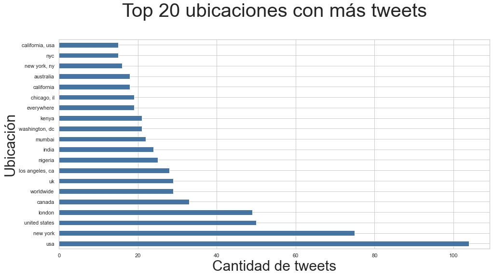

4. Utilización de la librería [GeoPy]: Esta librería recibe la columna "location" del dataframe y el resultado se almacena en la columna "geodata". Geopy dada la ubicación devuelve un objeto compuesto por "address" y "point". Adress es la dirección completa del lugar, por ejemplo, "City of Melbourne, Victoria, Australia", y point contiene las coordenadas. GeoPy da la opción de utilizar cualquier servicio de geocoding, en este caso se utilizó [Nominatim]. Nominatim es un servicio gratuito y open-source, permite un máximo de un request por segundo y eso hace que sea poco performante en tiempo. Es por eso que se persiste el archivo locations.csv, y solo es necesario correr GeoPy si no se encuentra el csv.
Una vez finalizado el filtrado con GeoPy se observa que no se encontraron 374 locaciones, el 94% de ellas con una sola aparición.

[GeoPy]: https://geopy.readthedocs.io/en/stable/
[Nominatim]: https://nominatim.org/

Una vez filtrado el dataset obtenemos:

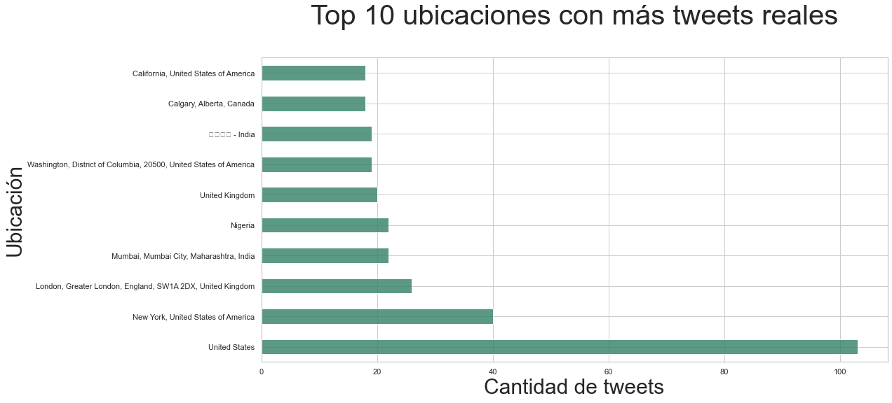

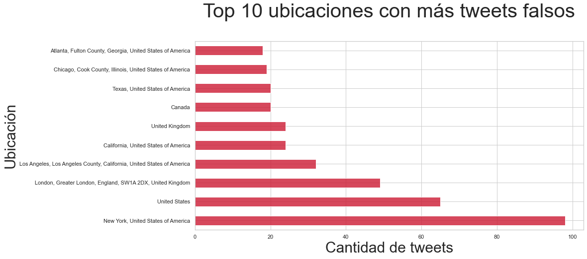

__Conclusiones:__ A priori los resultados son pequeños en proporción al tamaño del set. No podemos asegurar que haya una relación entre ubicación del tweet y nivel de veracidad. Se puede observar una tendencia a que ciudades de Estados Unidos compongan los dos top 10 pero esto puede ser explicado por las [estadísticas] de la red social Twitter que muestran que Estados Unidos compone el 64.2% de los usuarios, y así también la ciudad de Nueva York, que se encuentra en ambos top 10, es la ciudad más poblada de Estados Unidos. 

[estadísticas]: https://www.statista.com/statistics/242606/number-of-active-twitter-users-in-selected-countries/

### Ubicaciones no encontradas

__Hipótesis:__ Si bien el sistema de geocoding funcionó exitosamente en una gran parte del set habrá ubicaciones reales que no se encontraron.

Las siguientes son las ubicaciones no encontradas por GeoPy más frecuentes:

* road to the billionaires club
* edinburgh
* america of founding fathers
* bangalore, india
* buy give me my money
* financial news and views
* five down from the coffeeshop
* washington dc
* eastcarolina
* eic
* el dorado, arkansas
* england, united kingdom
* in the potters hands
* mad as hell
* reddit

__Conclusión:__ Se observan ubicaciones reales que el sistema no encontró como "england, united kingdom" pero también se observan ubicaciones falsas peculiares como "mad as hell".

### Países en el set:

__Hipótesis:__ Por lo antes mencionado Estados Unidos es el país que más cantidad de tweets tienen en su ubicación.

Con el dataset obtenido en el filtrado de locaciones se genera la columna "country". En la primera iteración se encuentra que hay paises redundantes, por ejemplo, "United States" Y "United States of America", por otro lado es necesario eliminar los espacios que también generan redundancias, como "Nigeria" y "Nigeria ". 

* Primera iteración:

| País						| Cantidad de tweets|
| ------------------------- |:-----:|
| United States of America 	| 1705	|
| United Kingdom			| 384	|
| Canada	   				| 239	|
| United States				| 168	|
| Australia					| 106	|
| India						| 84	|
| Nigeria					| 61	|
| Kenya						| 39	|
| Philippines				| 39	|
| Italia					| 34	|
| República Dominicana		| 32	|
| South Africa				| 31	|
| Indonesia					| 29	|
| France					| 25	|
| Ireland					| 25    |

* Segunda iteración:

Para esta parte del análisis se optó por la herramienta [geopandas] para mostrar los paises del dataset en el mapa. El dataframe que provee geopandas está en inglés y se puede observar que Nominatim devolvió ubicaciones en español, por ejemplo, "Italia". Con la [API] de google translator se tradujeron todas las ubicaciones a inglés.

[geopandas]: https://geopandas.org/mapping.html
[API]: https://pypi.org/project/googletrans/

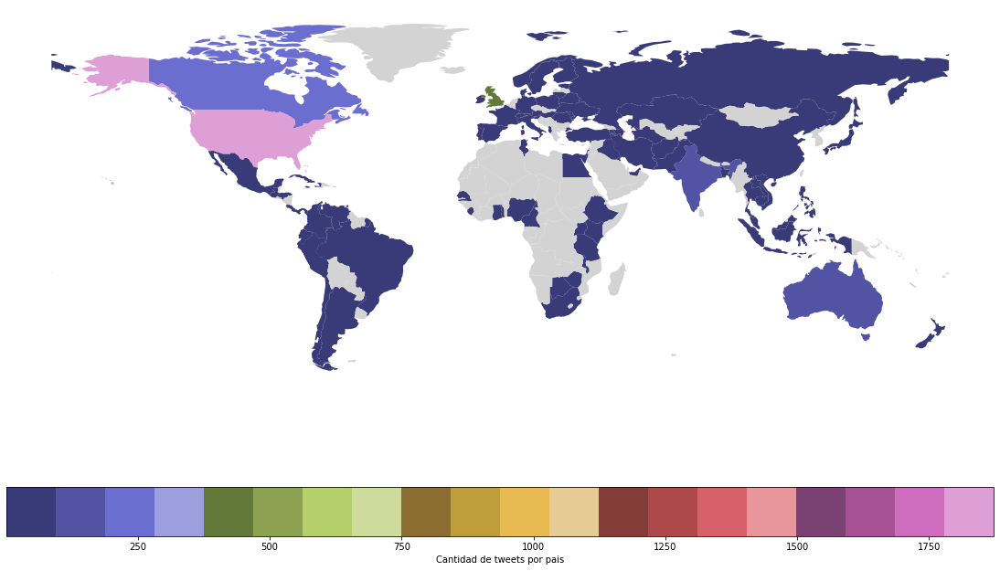

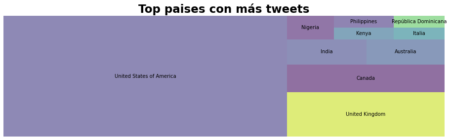

Según grado de veracidad del tweet:

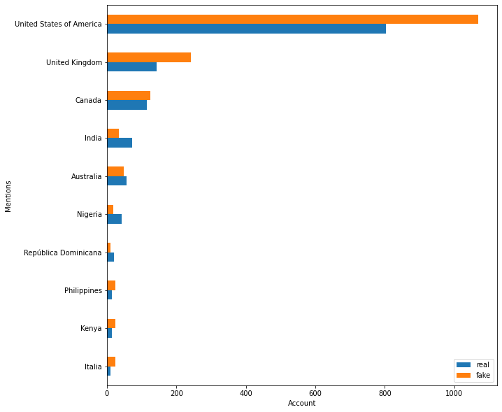

__Conclusión:__ La hipótesis fue confirmada, Estados Unidos es el país con mayor cantidad de tweets del set. Por otro lado se puede observar que hay una gran cantidad de paises presentes en el mapa dejando en evidencia la alta penetración que tiene Twitter alrededor del mundo siendo parte del [top 15] de redes sociales más utilizadas.

[top 15]: https://datareportal.com/reports/digital-2020-global-digital-overview

### Tweets con y sin ubicación o keyword nula

* Los tweets con keyword nula, son solo 56 de un set de más de 7600. No representa una muestra significativa para sacar una conclusión.

* Respecto a los tweets de ubicación nula los reales y los falsos continuan manteniendo la proporción de 58%-42%. Se decide aplicar un filtro más agrupándolos por largo del tweet, como se analizó previamente la totalidad del texto del set para buscar una relación entre cantidad de caracteres y nivel de veracidad según la falta de ubicación. A su vez se agrega la comparación segun cantidad de caracteres al subset de tweets con ubicación real.

__Conclusión:__ Como se observa en el gráfico no se encuentra una relación entre grado de veracidad según cantidad de caracteres y si el tweet tiene una ubicación o no, y que ambos análisis de subsets de tweets tienen un comportamiendo análogo entre sí y con el dataset completo dando un indicio de uniformidad en cuanto a la distribución de tweets reales y falsos del dataset.

### Relación condados costeros de Estados Unidos y el ratio de desastres reales.

Este análisis fue realizado gracias a información por fuera del dataset, que tuvo como objetivo explorar la distribución de sucesos reales ocurridos en condados costeros de Estados Unidos, para posterior análisis de la relación que tiene con desastres frecuentes en ese tipo de zonas.

Para esto se obtuvo la información de una [lista de condados costeros] de Estados Unidos provista por el _Economics: National Ocean Watch_, a partir de la cual se generó por elaboración propia un _csv_ con todos los datos provistos necesarios para el análisis. Esto luego permitió combinar los datos con nuestro dataset y asociarlo a ubicaciones reales provistas por el análisis geográfico realizado con GeoPy.

El análisis hizo foco en Estados Unidos ya que es el país con mayor participación en ubicaciones encontradas por el análisis geográfico según conclusión de **Top países participantes**.
Es así que entonces se procedió a generar un dataframe que mejor ajuste a la necesidad del análisis agregando la información a la ya provista por _locations.csv_ y separando en columnas útiles que facilitasen la realización de una visualización.

Para realizar la visualización se utilizó la biblioteca [Plotly] que es una librería gráfica de código abierto, con el objetivo de graficar la distribución de sucesos reales ocurridos en condados costeros utlizando el [USA County Choropleth] que permite graficar el país Estados Unidos a partir de los valores de [FIPS] que había en la lista previamente mencionada.

Debajo se puede apreciar la distribución de sucesos reales ocurridos en condados costeros de Estados Unidos.

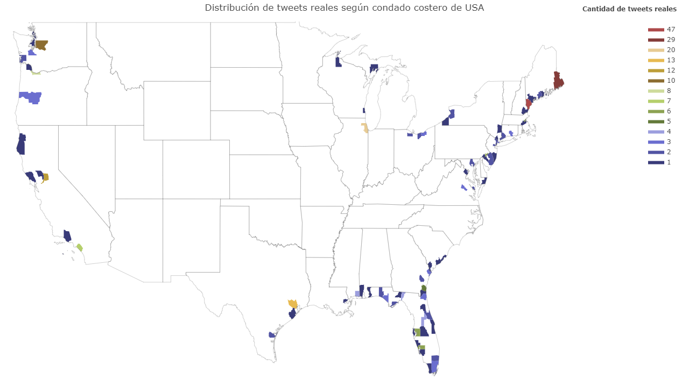

En base a lo visto arriba en el mapa, se procedió a analizar qué tipo de desastres ocurrieron en dichas ubicaciones.

**Hipótesis**: Dado que se pretende ver qué tipo de desastres son mencionados por los tweets reales, si se analizan las keywords de dichos tweets se espera que hablen sobre desastres comunes en una proporción normal, mientras que para desastres naturales como inundaciones, huracanes, tormentas tropicales (mayormente en el estado de Florida), terremotos (California), entre otros desastres naturales que suelen ocurrir en zonas costeras, se espera que se mencionen en una mayor proporción.
Para esto se realizó un gráfico que permite observar las 20 keywords más mencionadas en tweets reales.

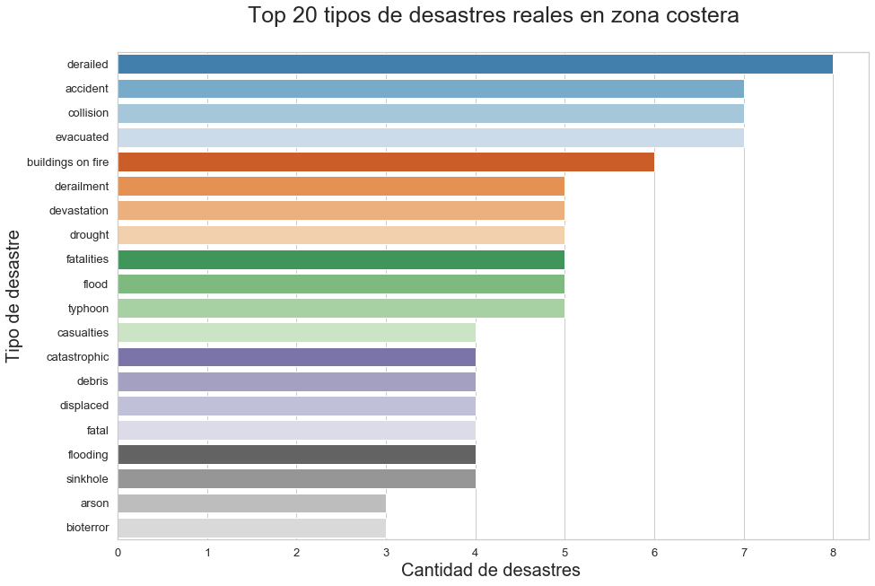

**Conclusión**: Por lo visto en el gráfico, la hipótesis no fue confirmada en su totalidad, pero si muestra una tendencia a nombrar estos tipos de desastres comunes a zonas costeras. El caso más notorio es el de inundaciones (provistas por _flood_ y _flooding_) que es el más mencionado.
Es importante mencionar que como sucedió con las ubicaciones de los tweets en general, existen redundancias (como la mencionada previamente) que puede sesgar el análisis, y que no es viable analizar caso por caso ya que por ejemplo se mencionan _buildings on fire_ y _burning buildings_ que a menos que se los analice individualmente no es posible agruparlos.
Sin embargo, no se demuestra una variedad de estos tipos de desastres comunes a zonas costeras según la hipótesis, ya que aún formando parte del top, keywords como _typhoon, evacuated y catastrophic_ no son mayormente mencionadas y el caso particular de las últimás dos no necesariamente pueden referirse a desastres naturales de los mencionados previamente.

Aún así, se puede ver que hay keywords que _pueden_ estar relacionadas a este tipo de desastres, con lo cual se puede ver que existe cierta relación entre la ubicación del tweet y el tipo de desastre sobre el que habla.  

[Plotly]: https://plotly.com/python/
[FIPS]: https://en.wikipedia.org/wiki/FIPS_county_code
[USA County Choropleth]: https://plotly.com/python/county-choropleth/
[lista de condados costeros]: https://coast.noaa.gov/digitalcoast/training/enow-counties-list.html

